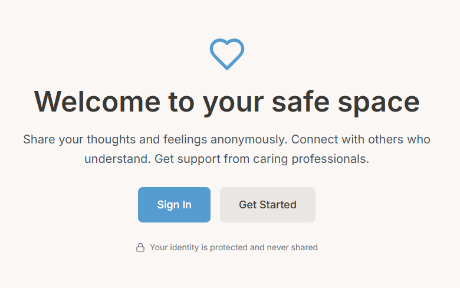

<div align="center">
  
  <h1>💙 Lore Emotion</h1>
  <p><em>Your safe space to share, connect, and heal</em></p>
</div>

---

## What is Lore Emotion?

A **privacy-first emotional support platform** where you can share your thoughts anonymously, connect with others who understand, and access professional care—all in a warm, judgment-free environment.

---

## ✨ Core Experience

### Share Safely
Write about what's on your mind. Your identity is protected through **military-grade anonymization**—no one knows it's you, not even us.

### Find Your People
Our AI connects you with others who've felt the same way. You're never alone in your experience.

### Get Support
Trained professionals review posts and provide guidance. Crisis support is available 24/7.

---

## 📸 Platform Screenshots

<div align="center">

### Welcome & Onboarding

<p><em>Warm, empathetic welcome with clear privacy messaging</em></p>

### Anonymous Post Creation

<p><em>Safe space to share with real-time privacy indicators</em></p>

### Community Feed

<p><em>Discover similar experiences and supportive responses</em></p>

### Professional Support

<p><em>Expert guidance from trained mental health professionals</em></p>

### Personal Dashboard

<p><em>Track your journey with gentle progress indicators</em></p>

### Crisis Support

<p><em>Immediate access to help when you need it most</em></p>

</div>

---

## 🛡️ How We Keep You Safe

**Anonymization Pipeline**
- Every post gets a cryptographic anonymous ID
- Personal details are automatically removed
- Your identity lives in a separate, encrypted vault

**Smart Moderation**
- AI screens for harmful content in real-time (<100ms)
- Crisis detection triggers immediate intervention
- Human professionals review flagged content within 1 hour

**Privacy by Design**
- Two separate databases: one for your identity, one for content
- Zero-knowledge architecture—we can't connect posts to real identities
- Complete data encryption at rest and in transit

---

## 🎨 Design Philosophy

Inspired by **Lore.co**, we believe emotional support should feel:

- **Warm** → Soft blues and sage greens that calm
- **Safe** → Clear privacy indicators everywhere
- **Empowering** → You control your data and experience
- **Human** → Conversational, never clinical

---

## 🏗️ How It Works

```
┌─────────────┐
│  You write  │  → Anonymous post created
└──────┬──────┘
       ↓
┌─────────────┐
│  AI checks  │  → Safety screening + PII removal
└──────┬──────┘
       ↓
┌─────────────┐
│  Community  │  → Similar posts found, support given
└──────┬──────┘
       ↓
┌─────────────┐
│Professional │  → Expert review + guidance
└─────────────┘
```

---

## 🔧 Technology Stack

**Backend** → Python FastAPI with AWS Cognito auth  
**Frontend** → Next.js 14 with beautiful Tailwind UI  
**Database** → PostgreSQL (separate for identity & content)  
**ML/AI** → Sentence transformers for similar post discovery  
**Cache** → Redis (local) / AWS ElastiCache (production) for performance  

---

## 🚀 Quick Start

```powershell
# Backend
cd backend
python -m venv venv
.\venv\Scripts\Activate.ps1
pip install -r requirements.txt
python app/main.py

# Frontend
cd frontend
npm install
npm run dev
```

Visit: `http://localhost:3000`

---

## 📊 Success Metrics

We measure what matters:

- **Safety**: Crisis response <1 hour (target: >95%)
- **Trust**: User safety rating >4.2/5
- **Wellbeing**: 60%+ report feeling better after interaction
- **Privacy**: Zero successful re-identification attempts

---

## 🌟 What Makes Us Different

| Traditional Platforms | Lore Emotion |
|----------------------|---------------|
| Profile-based | Truly anonymous |
| Algorithm-driven engagement | Human-centered care |
| Reactive moderation | Proactive safety |
| Data monetization | Privacy by design |
| Endless scrolling | Healthy boundaries |

---

## 🎯 Roadmap

**Now** → Core anonymization + moderation + crisis intervention  
**Next** → ML-powered similar post discovery + mobile apps  
**Soon** → Peer support program + advanced analytics  
**Future** → Healthcare integration + virtual support groups  

---

## 💬 Crisis Resources

**Need immediate help?**

🇺🇸 **US**: Call or text **988** (Suicide & Crisis Lifeline)  
🇬🇧 **UK**: Call **116 123** (Samaritans)  
🌍 **International**: https://findahelpline.com/

*You're not alone. Help is available 24/7.*

---

## 🤝 Join Us

We're building something different—a place where vulnerability is strength and privacy is paramount.

**For Users** → Sign up and share your story  
**For Professionals** → Help others as a verified responder  
**For Developers** → Contribute to open safety tools  

---

## 📄 Documentation

- **[Full README](README.md)** → Complete system documentation
- **[Backend Setup](backend/SETUP.md)** → Python/FastAPI setup guide
- **[Frontend Setup](frontend/SETUP.md)** → Next.js setup guide
- **[Project Overview](PROJECT_README.md)** → Architecture & features

---

<div align="center">

**Built with 💙 for those who need a safe space**

*Privacy-First • Human-Centered • Always Free*

</div>
